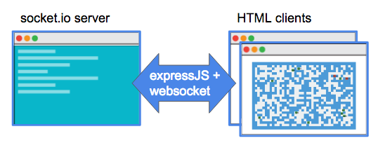

# game-multipixel

Simple game architecture oriented mutli-pixel/player with socket.IO

# Architecture

# Client-Server Communication

##### All the logic are server side: Map creation, bots animations, ...

##### User movements...

# Tech

* socket.IO
* Node.js + Express

# License

MIT
